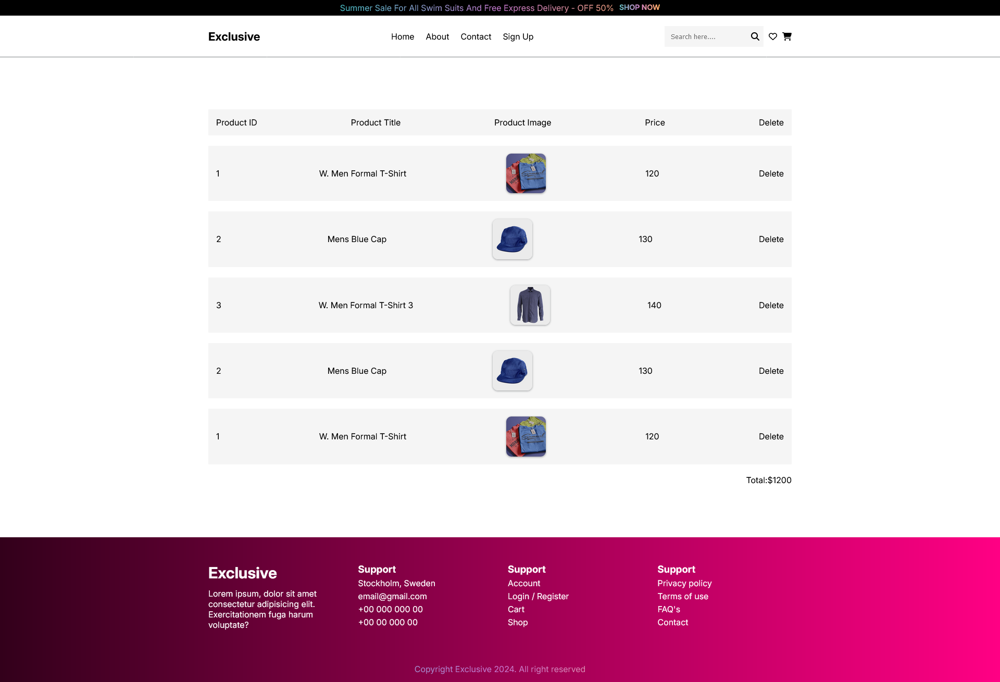
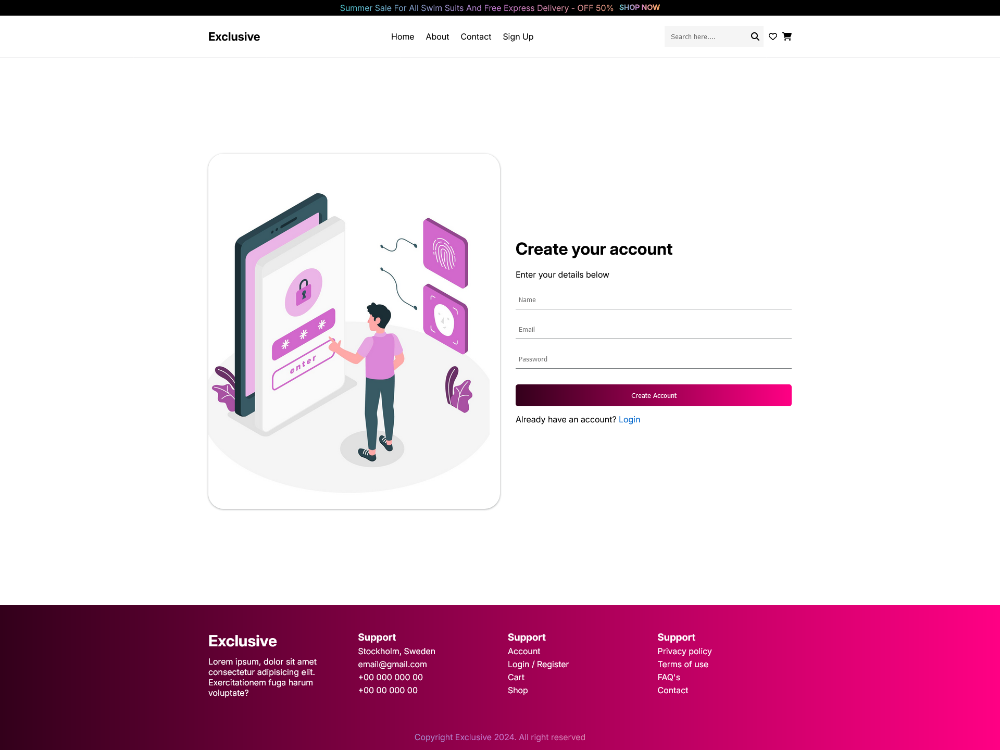

# Master Mall - One stop , Every Need 
## Live Site Link: https://master-mall-bk.netlify.app/
### Technology Used : 
- HTML, 
- CSS, 
- JS. 

### Packages used:
- Swiper 
- scrollReveal

### Others
- Font-Awesome
- Hero Icon

#### Webpages View

- Home Page

- Cart Page

- About Page

- Sign Up Page

##### https://themeforest.net/item/minimalin-minimal-multipurpose-shopify-theme-os-20/48223754
https://themeforest.net/item/swiftcart-ecommerce-multipurpose-html-template/54554429

/* .continue-shopping-btn button,
.clear-cart-btn button,
.check-out-btn button {
    padding: 10px 20px;
    border: none;
    background: #ff0084;
    background: linear-gradient(to right, #33001b, #ff0084);
    border-radius: 25px;
    color: var(--colo-white-2);
    font-weight: 600;
    cursor: pointer;

}

.continue-shopping-btn button:hover,
.clear-cart-btn button:hover,
.check-out-btn button:hover {
    background: linear-gradient(to right, #ff0084, #33001b);
    transform: scale(1.05);
    box-shadow: 0px 4px 15px rgba(0, 0, 0, 0.3);
}

.continue-shopping-btn button:active,
.clear-cart-btn button:active,
.check-out-btn button:active {
    transform: scale(0.98);
    transition: transform 0.1s ease;
} */