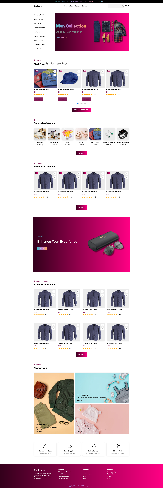
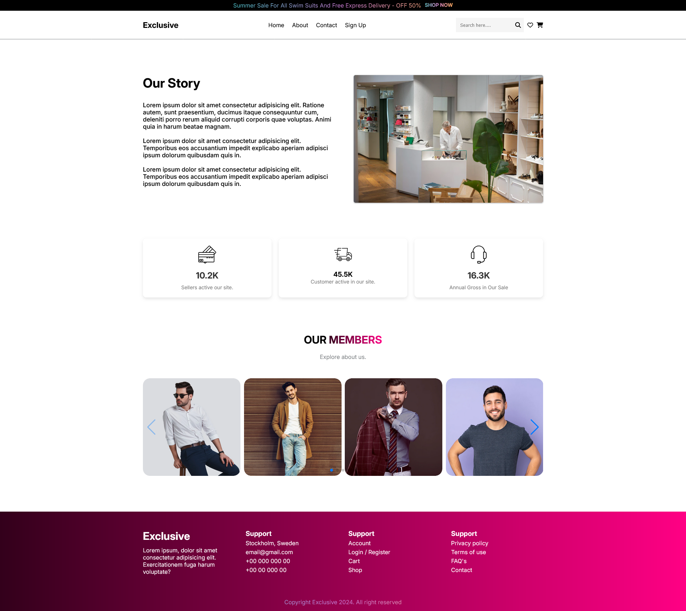

# Master Mall - One stop , Every Need 
## Live Site Link: https://master-mall-bk.netlify.app/
### Technology Used : 
- HTML, 
- CSS, 
- JS. 

### Packages used:
- Swiper 
- scrollReveal

### Others
- Font-Awesome
- Hero Icon

#### Webpages View

- Home Page

- Cart Page

- About Page

- Sign Up Page

##### https://themeforest.net/item/minimalin-minimal-multipurpose-shopify-theme-os-20/48223754
https://themeforest.net/item/swiftcart-ecommerce-multipurpose-html-template/54554429

MasterMall/
├── datasets/           # JSON files for dynamic content
│   ├── article.json
│   ├── categories.json
│   ├── products.json
│   ├── services.json
│   └── team-members.json
├── image/              # Images used in the website
│   ├── about/
│   ├── banner/
│   ├── blog/
│   ├── cart/
│   ├── category/
│   ├── contact/
│   ├── gallery/
│   ├── icons/
│   ├── logo/
│   ├── product/
│   ├── services/
│   ├── webPageImage/
│   └── favicon.ico
├── JavaScript/         # JavaScript files for functionality
│   ├── about.js
│   ├── article-details.js
│   ├── blog.js
│   ├── cart.js
│   ├── checkout.js
│   ├── contact.js
│   ├── countDown.js
│   ├── createAccount.js
│   ├── Home.js
│   ├── nav.js
│   └── scrollReveal.js
├── Style/              # CSS files for styling
│   ├── about.css
│   ├── article-detail.css
│   ├── blog.css
│   ├── cart.css
│   ├── checkout.css
│   ├── contact.css
│   ├── createAccount.css
│   ├── footer.css
│   ├── nav.css
│   └── Style.css
├── about.html          # About page
├── article-details.html # Article details page
├── blog.html           # Blog page
├── cart.html           # Cart page
├── checkout.html       # Checkout page
├── comingSoon.html     # Coming soon page
├── contact.html        # Contact page
├── index.html          # Main HTML file
├── login.html          # Login page
├── signUp.html         # Signup page
└── README.md          # Project description

